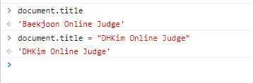

# JavaScript 공부

- 필요성 
  - 브라우저 화면을 동적으로 만들 수 있다.
  - 브라우저를 조작할 수 있는 유일한 언어이다.


### 🛴DOM(Document Object Model)

-----------------------

- HTML, XML과 같은 문서를 다루기 위한 문서 프로그래밍 인터페이스

- 문서를 구조화하고 구조화된 구성 요소를 하나의 객체로 생각해서 다루는 논리적 트리 모델이다.
- 단순한 속성 접근, 메서드 활용이 가능하고 프로그래밍 언어를 활용한 조작도 가능하다.



- DOM 조작 순서 (Document는 문서 한장에 해당하고 이를 조작한다.)
  1. 선택
  2. 변경

### 🛴BOM(Browser Object Model)

-------------------------------

- 자바스크립트가 브라우저와 소통하기 위한 모델이다.

- 브라우저 창이나 프레임을 추상화해서 프로그래밍적으로 제어할 수 있도록 제공하는 수단
  - 버튼, URL, 타이틀바 등등..


### 🛴DOM 조작

---------

#### DOM 관련 객체의 상속 구조

- EventTarget
  - Event Listener를 가질 수 있는 객체가 구현하는 DOM 인터페이스
- Node
  - 여러가지 DOM 타입들이 상속하는 인터페이스
- Element
  - Document안의 모든 객체가 상속하는 가장 범용적인 기반 클래스
  - 부모인 Node와 그 부모인 EventTarget의 속성을 상속한다.
- Document
  - 브라우저가 불러온 웹 페이지를 나타낸다.
  - DOM 트리의 진입점 역할을 수행한다.
- HTMLElement
  - 모든 종류의 HTML 요소
  - 부모 element의 속성을 상속한다.


#### DOM 선택 관련 메서드

- Document.querySelector(selector)
  - 제공한 선택자와 일치하는 하나의 element를 선택한다.
  - 제공한 CSS selector를 만족하는 첫 번째 element 객체를 반환하고 없다면 null을 반환한다.
  - 주로 id나 class를 사용한다.
- Document.querySelectorAll(selector)
  - 제공한 선택자와 일치하는 여러 element를 선택한다.
  - 매칭 할 하나 이상의 셀렉터를 포함하는 유효한 CSS selector를 인자로 받는다.
  - 지정된 셀렉터에 일치하는 NodeList를 반환시킨다.
- getElementById(id)
- getElementsByTagName(name)
- getElementsByClassName(names)


- querySelecotr을 더 많이 사용하는 이유 : `querySelector, querySelectorAll은 id, class, tag선택자 등 모두 사용가능하므로 더 구체적이고 유연하게 선택이 가능하여 사용을 많이 한다.`


#### DOM 선택 - 메서드별 반환 타입

1. 단일 Element
   - getElementById()
   - querySelecotr()
2. HTMLCollection
   - getElementsByTagName()
   - getElementsByClassName()
3. NodeList
   - querySelectorAll()


#### DOM 선택 - HTMLCollection, NodeList

- 둘다 배열과 같이 항목에 접근하기 위한 Index를 제공한다.
- HTMLCollection
  - name, id, index 속성으로 각 항목에 접근 가능하다.
- NodeList
  - index로만 각 항목에 접근이 가능하다.
  - HTMLCollection과 다르게 함수 및 다양한 메서드를 사용 가능하다.


- Live Collection
  - 문서가 바뀔 때 실시간으로 업데이트 된다.
  - DOM의 변경사항을 실시간으로 collection에 반영한다.
  - ex) HTMLCollection, NodeList
- Static Collection(non-live)
  - DOM이 변경되어도 collection 내용에는 영향을 주지 않는다.
  - querySelectorAll()의 반환 NodeList만 static collection 이다.


#### DOM 변경 - 변경 메서드

- Document.createElement()

  - 작성한 태그 명의 HTML 요소를 생성하여 반환시킨다.

    ```javascript
    const liTag = document.createElement('li')
    const ulTag = document.createElement('ul')
    ```

- Element.append()

  - 특정 부모 Node의 자식 NodeList중 마지막 자식 다음에 Node 객체나 DOMstring을 삽입한다.
  - 여러개의 Node객체, DOMString 추가가 가능하다.
  - 반환값이 없다.

- Node.appendChild()

  - 한 Node를 특정 부모 Node의 자식 NodeList 중 마지막 자식으로 삽입한다.
  - 한번에 하나의 Node만 추가가 가능하다.
  - 만약 주어진 Node가 이미 문서에 존재하는 다른 Node를 참조하면 새로운 위치로 이동한다.

  ```javascript
  const new1 = document.createElement('li')
  new1.innerText = '리스트 1'
  const new2 = document.createElement('li')
  new2.innerText = '리스트 2'
  const new3 = document.createElement('li')
  new3.innerText = '리스트 3'
  ulTag.append(new1, new2, new3)
  
  // appendchild
  const ulTag = document.querySelector('ul')
  const newLiTag = document.createElement('li')
  newLiTag.innerText = '새로운 리스트 태그'
  ulTag.appendChild(newLiTag)
  ```


- Node.innerText

  - Node 객체와 그 자손의 텍스트 컨텐츠를 표현한다.

- Element.innerHTML

  - 요소 내에 포함된 HTML 마크업을 그대로 반환시킨다.

  ```javascript
  const ulTag = document.querySelector('ul')
  const liTag1 = document.createElement('li')
  // li까지 같이 들어간다.
  liTag1.innerText = '<li>서울</li>'
  // 서울 요소만 들어간다.
  const liTag2 = document.createElement('li')
  liTag2.innerHTML = '<li>서울</li>'
  ulTag.append(liTag1, liTag2)
  ```

  

#### DOM 삭제 관련 메서드

- childNode.remove()
  - Node가 속한 트리에서 해당 Node를 제거한다.

- Node.removeChild()
  - DOM에서 자식 Node를 제거하고 제거된 Node를 반환시킨다.
  - Node는 인자로 들어가는 자식 Node의 부모 Node

```javascript
const parent = document.querySelector('ul')
const child = document.querySelector('ul > li')
const removedChild = parent.removeChild(child)
```


#### DOM 속성 관련 메서드

- Element.setAttribute(name, value)

  - 지정된 요소의 값을 결정한다.
  - 속성이 이미 존재하면 값을 갱신하고 존재하지 않으면 지정된 이름과 값으로 새 속성을 추가시킨다.

  ```javascript
  const header = document.querySelector('#location-header')
  header.setAttribute('class', 'class-location')
  ```

- Element.getAttribute(attributeName)

  - 해당 요소의 지정된 값을 반환시킨다.
  - 인자는 값을 얻고자 하는 속성의 이름

  ```javascript
  const getAttr = document.querySelector('.class-location')
  getAttr.getAttribute('class')
  ```

  


### Event (이벤트) 개념

------------------------------

- 네트워크 활동이나 상호작용 같은 사건의 발생을 알리기 위한 객체이다.
- 이벤트 발생
  - 마우스를 클릭하거나 키보드를 누르는 등 사용자 행동으로 발생할 수도 있다.
  - 특정 메서드를 호출하여 프로그래밍적으로 만들어 낼 수 있다.
- UIEvent
  - 간단한 사용자 인터페이스 이벤트
  - MouseEvent, KeyboardEvent 등등.


#### Event handler

- EventTarget.addEventListener()
  - 지정한 이벤트가 대상에 전달될 때마다 호출할 함수를 설정해준다.
  - 이벤트를 지원하는 모든 객체를 대상으로 지정이 가능하다.


- target.addEventListener(type, listener(option))
  - type
    - 반응 할 이벤트 유형
  - listener
    - 지정된 타입의 이벤트가 발생했을 때 알림을 받는 객체
    - EventListener 인터페이스 혹은 JS function 객체이어야 한다.

```javascript
<script>
    const btn = document.querySelector('button')
	btn.addEventListener('click', function(event) {
        alert('버튼 클릭')
    })
</script>
```

```html
<button id="my-button">눌러!</button>
<script>
	const mybutton = document.querySelector('#my-button')
	mybutton.addEventListener('click', alertMessage)
</script>
```


- Event 취소

  - `Event.preventDefault()`
  - 현재 이벤트의 기본 동작을 중단시킨다.
  - 태그의 기본 동작을 작동하지 않게 막는다.
  - 이벤트를 취소할 수 있는 경우, 이벤트의 전파를 막지 않고 그 이벤트를 취소한다.

  ```javascript
  document.addEventListener('scroll', function (event) {
      console.log(event)
      event.preventDefault()
  })
  ```

  - 취소 할 수 없는 이벤트도 존재하며 취소 가능 여부는 event.cancelable을 사용해 확인해 볼 수 있다.
