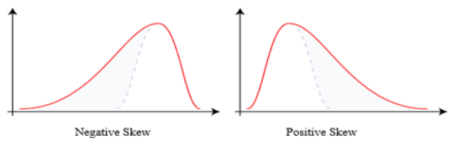

# 기본요소

# **Feature Engineering**

---

- 머신러닝 알고리즘이 작동할 수 있도록 하는 Feature들을 만드는 과정으로 데이터에 대한 도메인 지식을 사용한다.
- 근본적인 부분이자 매우 까다로운 부분
    - 적절히 수행하였을 때 결과가 매우 좋음 → 알고리즘 차이 요소
    

## 데이터 클리닝 & 데이터 전처리

---

### 1. 아웃라이어 다루기

- 아웃라이어는 데이터의 일반적인 추세를 따르지 않는 데이터 포인트
    - 아웃라이어의 수가 많지 않으면 완전히 제거해도 가능
    - 많은 아웃라이어를 발견한다면 열 제거도 가능, 행도 마찬가지
- 모든것들을 Log형태로 전환시키기 → 로그는 모든 것들을 같은 거리로 옮긴다.(수치적 데이터만 가능)
- Scatterplot, 히스토그램, Boxplot을 사용하여 시각화 하기

### 2. 누락된 값 다루기

- 누락된 데이터는 모델의 적합성과 power를 줄일 수 있다. → 누락된 값들은 편향된 모델로 이끌기 때문에 분석이 제대로 되지 않는다.
- 평균, 중앙값, 빈도수와 같은 값으로 대체가 가능
    - sklearn.preprocessing.impute 라이브러리를 사용할 수도 있다.
      
        ```python
        from sklearn.impute import SimpleImputer
        
        # most_frequent : 최빈값, mean : 평균값, median : 중앙값
        imputer = SimpleImputer(strategy="most_frequent")
        
        df = pd.DataFrame(imputer.fit_transform(df), columns=df.columns)
        
        # 열을 지정해서 개별적 채우기 가능
        ```
    
- 누락된 값들이 너무 많을 경우 열을 완전히 지우는게 유리

### 3. 기울어진 정도를 다루기



- Skewness는 분포의 비대칭성에 대한 측정
- Skewness를 다루는 이유
    - 많은 모델 생성 기법들이 가정을 가지고 있는데, 가정은 변수들이 정규 분포를 따르며 분포되어 있다. → 대칭적인 형태를 가질 것이다. 따라서 기울어진 정도를 다루는 것이 중요하다.
    - 대칭적인 분포는 추론을 해석하고 생성하는게 쉽다.
    - 로그 변환, 루트변환 사용 가능
    

## Scaling

---

- 누락된 값 다루기에 비해서 중요하지는 않다.
- Scaling은 Feature를 수정하여 최소값과 최대값 사이로 정렬 → 0과1 사이 또는 각 Feature 단위 사이즈로 스케일링 시켜 모델의 수치적 안정성을 향상시킨다.
- Scaling은 카테고리 데이터에는 적용되지 않으므로 수치적인 데이터를 분리해서 표준화 시킨다.

### Standard Scaler

- 기존 변수의 범위를 정규 분포로 변환
- 데이터의 최대 최소를 모를 때 사용
- Feature의 평균을 0, 분산을 1로 만듬
- 이상치가 있다면 평균과 표준편차에 영향을 미치기 때문에 이상치가 많으면 사용하지 않는게 좋음

```python
from sklearn.preprocessing import StandardScaler

std = StandardScaler()
trans_data = std.fit_transform(data)
```

### Normalizer

- 각 변수의 값을 원점으로부터 1만큼 떨어져 있는 범위 내로 변환
    - 빠르게 학습이 가능하고 과대적합을 낮출 수 있다.
    

```python
from sklearn.preprocessing import Normalizer

normal = Normalizer()
normal_data = normal.fit_transform(data)
```

### MinMax Scaler

- 데이터 값들을 0~1 사이로 변환시키는 것
    - **이상치**가 있을 경우 매우 좁은 범위로 압축이 될 수 있다.
- 각 변수가 정규분포 이거나 표준분포일 때 효과적이다.

```python
from sklearn.preprocessing import MinMaxScaler

minmax = MinMaxScaler()
minmax_data = minmax.fit_transform(data)
```

## One-hot encoding

- 범주형 자료를 수치형 자료로 바꿔서 정보 손실 없이 그룹화 가능
  
    ```python
    import pandas as pd
    
    pd.get_dummies(data)
    ```